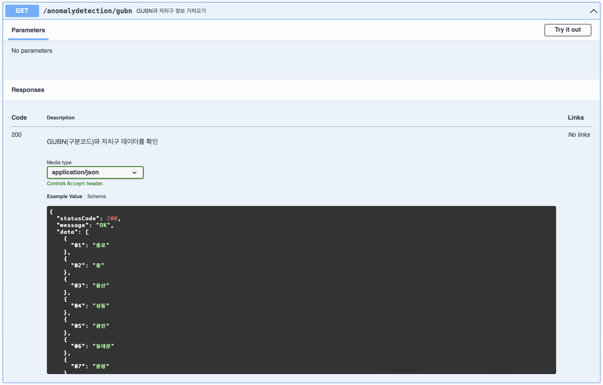
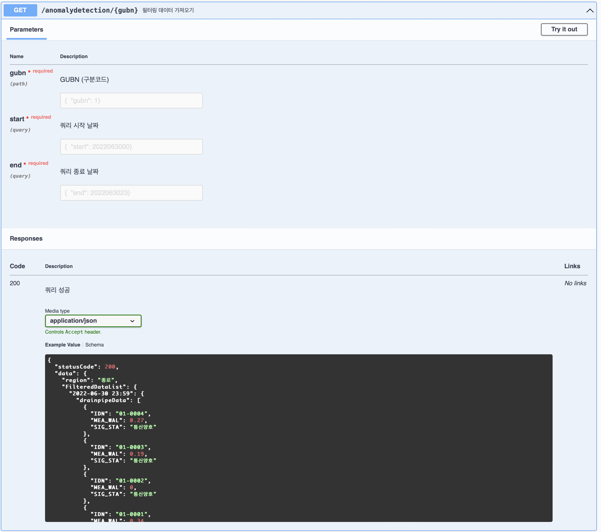
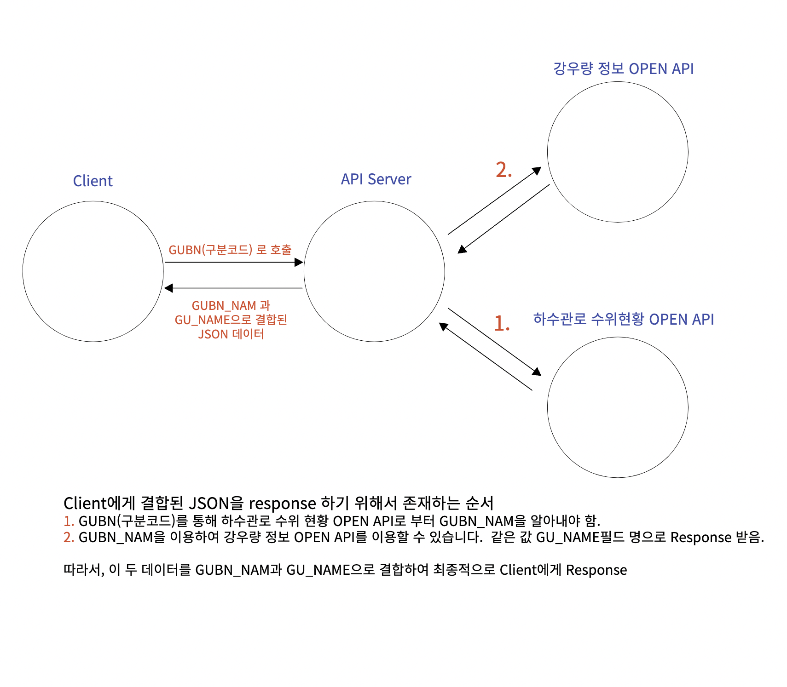
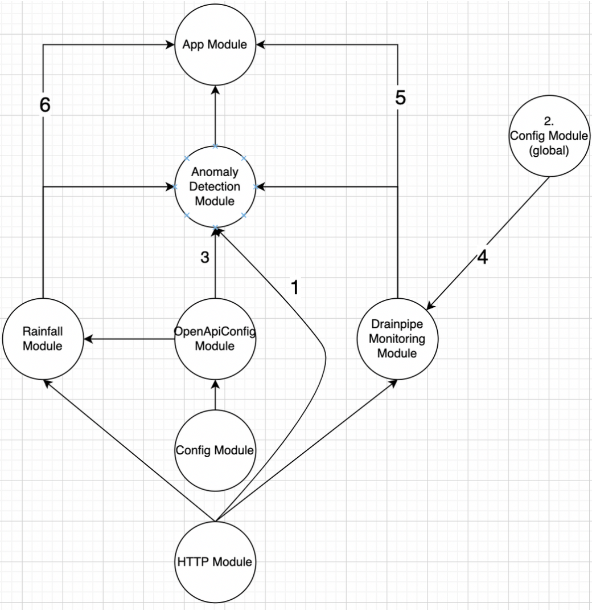
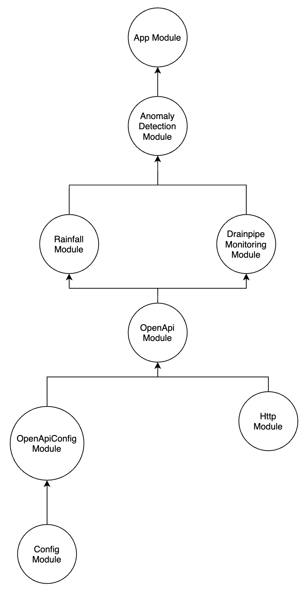

<h1 align=center><strong>1주차: LabQ 기업과제<strong></h1>

<p align=center>


</p>
<p align=center>
    
    
    
</p>

### **RUN**

```shell
$ git clone https://github.com/3rd-wanted-pre-onboarding-team-D/01-LabQ-wanted-D.git
$ cd 01-LabQ-wanted-D
$ npm i --silent
$ npm run start
```

### **환경변수 설정**
```.env
OPEN_API_KEY={인증키}
```

### **API 명세 문서**
- Swagger 사용
- http://localhost:3000/api/
<details>
<summary>GET /anomalydetection/gubn</summary>

</details>
<details>
<summary>GET /anomalydetection/{gubn}</summary>

</details>

### **과제 용어 정리**

- GUBN_NAM (하수관로 수위 현황 - 구분명 출력값)
- GU_NAME (강우량 정보 - 구청명 출력값)
- GUBN (하수관로 수위 현황 - 구분코드 요청값)

### **요구사항 분석**

- 클라이언트가 요청하는 서울시 구별 강우량 정보와 그에 따른 하수관로 수위 현황을 제공하는 서비스
  - 서울시 구별 강우량 현황을 받아오는 OPEN API 모듈 개발이 필요함.
  - 서울시 하수관로 수위 현황을 받아오는 OPEN API 모듈 개발이 필요함.
  - 클라이언트로부터 받은 GUBN과 날짜를 기준으로 강우량과 수위 현황을 매핑 후에 데이터를 응답하는 모듈 개발이 필요함.
    - 매핑 기준은 GUBN과 일(Day)로 한다.

### **팀원별 역할**

- 프로젝트 세팅
  - 담당: [@JuyeopJang](https://github.com/JuyeopJang)
  - Hot-Reload, response-interceptor, ConfigModule
- 강수량 api 모듈 제작
  - 담당: [@username1103](https://github.com/username1103)
  - OpenAPI를 요청해 데이터 가져오는 모듈
- 하수관로 api 모듈 제작
  - 담당: [@reumachoi](https://github.com/reumachoi)
  - OpenAPI를 요청해 데이터 가져오는 모듈
- Data 처리 모듈 제작
  - 담당: [@khsexk](https://github.com/khsexk)
  - 두 OpenAPI 모듈을 통해 가져온 데이터 파싱
- Response 관리
  - 담당: [@YongsHub](https://github.com/YongsHub)
  - 데이터 처리 모듈을 import해서 response까지

### **Response 예시**

```text
- 클라이언트가 잘못된 또는 없는 구분코드(GUBN)으로 API 호출시 BadRequestResponse
- 올바른 구분코드(GUBN)을 명시하여 API 호출을 하는 경우
- OPEN API 호출에 실패할 경우의 Response
```

### **DFD**


### **Module Dependencies**

<details>
<summary>Before Refartor</summary>

<div markdown="1">
- HTTP모듈을 DrainpipeMonitoring, Rainfall, AnomalyDetection 3개의 모듈에서 각각 받음
- Rainfall모듈의 경우 Config모듈을 OpenApiConfig모듈로 받고 DrainpipeMonitoring모듈의 경우엔 Config모듈을 전역모듈로 받음
- App모듈에서 Config, OpenApiConfig, DrainpipeMonitoring, Rainfall, AnomalyDetection 모듈을 다 받음
</div>
</details>

<details>
<summary>After Refartor</summary>

<div markdown="1">
- OpenApi모듈로 Config와 Http모듈을 통합해서 Rainfall, DrainpipeMonitoring 모듈에서 사용
- App모듈에 불필요하게 가져오던 모듈들을 정리하고 AnomalyDetection모듈만 사용
</div>
</details>
